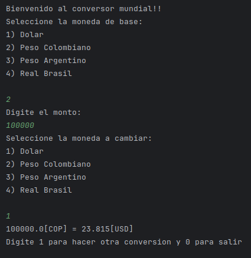

# Conversor de Monedas

Este proyecto es un **conversor de monedas** desarrollado como proyecto final del curso. El programa permite convertir valores entre diferentes monedas utilizando una API de tipo de cambio en tiempo real.

## Características

- Conversión entre varias monedas:
    - Dólar estadounidense (USD)
    - Peso colombiano (COP)
    - Peso argentino (ARS)
    - Real brasileño (BRL)
- La aplicación solicita al usuario la moneda base, el monto a convertir y la moneda de destino.
- Utiliza la API de tasas de cambio para obtener los datos de conversión en tiempo real.
- Funcionalidad de conversión continua: el usuario puede realizar múltiples conversiones hasta que decida salir.

## Tecnologías utilizadas

- **Java 17**: Lenguaje de programación principal.
- **Gson**: Librería utilizada para manejar la conversión de JSON a objetos Java.
- **HttpClient**: Para realizar solicitudes HTTP a la API de tipo de cambio.
- **Scanner**: Para la entrada de datos del usuario a través de la consola.

## Requisitos previos

- Tener instalado **Java 17** o superior en tu sistema.
- Acceso a internet, ya que el conversor consulta una API externa para los tipos de cambio.

## Instalación

1. Clona el repositorio o descarga los archivos del proyecto.

   ```bash
   git clone https://github.com/tuusuario/conversor-de-monedas.git


